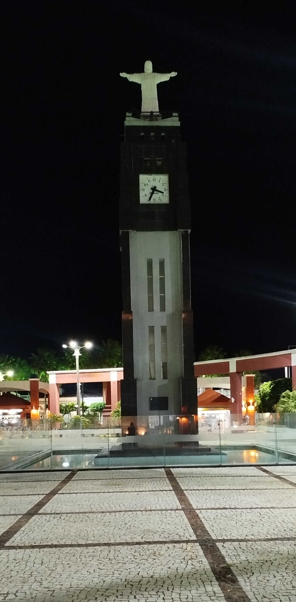

# Trabalho da cadeira de Computação Gráfica da UFC em Russas

A proposta é modelar a "Coluna da Hora", da cidade de Russas-CE, seu relógio e o cristo no topo, permitindo ao usuário explorar o ambiente em primeira pessoa. 
Ao redor da torre, também serão modelados elementos típicos da praça, como bancos de madeira, postes de iluminação, calçamento em padrão de ladrilhos e árvores.

